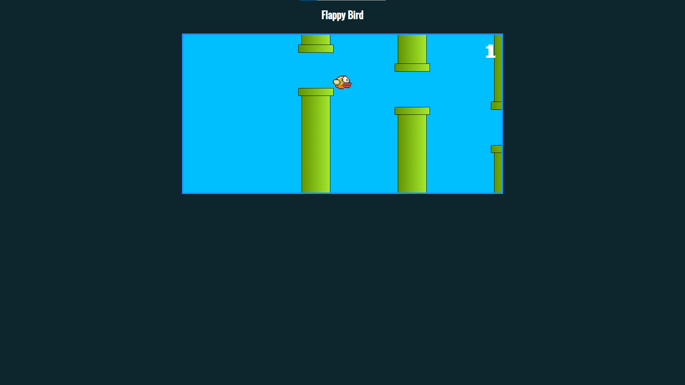

## Clone do Flappy Bird

Este é um clone do popular jogo Flappy Bird, onde os jogadores controlam um pássaro que deve navegar através de uma série de canos sem colidir com eles.

## Descrição do Jogo

Flappy Bird é um jogo de rolagem lateral onde o jogador controla um pássaro, tentando voar entre colunas de canos verdes sem bater neles. O pássaro desce automaticamente, mas bate as asas para cima cada vez que o jogador toca na tela ou pressiona uma tecla.

## Como Jogar

Pressione ESPAÇO ou clique/toque na tela para fazer o pássaro bater as asas e voar para cima 
Navegue através dos espaços entre os canos 
Cada par de canos ultrapassado com sucesso lhe rende um ponto 
O jogo termina quando o pássaro colide com um cano  

## Recursos do Jogo

Jogabilidade simples com apenas um botão 
Dificuldade crescente conforme você progride 
Contagem de pontuação 
Efeitos sonoros para batida de asas, pontuação e fim de jogo 
Design responsivo que funciona em desktop e dispositivos móveis 

## Tecnologias Utilizadas

 
  
  
  

 

## Imagem 1

